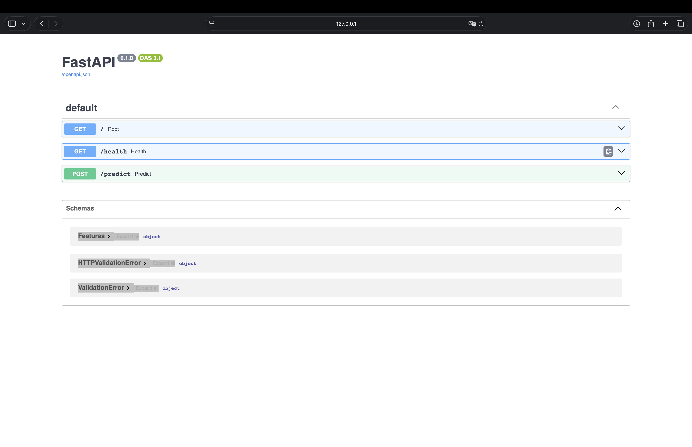

# MLOps Pipeline (Engineer Track)

## API Preview


### Try it quickly
```bash
# from this folder
uv run python src/train.py
uv run uvicorn --app-dir "api" app:app --reload
```

# in another terminal:
curl http://127.0.0.1:8000/health
curl -X POST http://127.0.0.1:8000/predict \
  -H "Content-Type: application/json" \
  -d '{"features":[4,1]}'

**Role match:** Senior AI/ML Engineer – Business Technology

This project demonstrates an end-to-end ML workflow:
- data cleaning & feature engineering
- model training & evaluation
- FastAPI service for inference
- Docker packaging and CI tests

## Quickstart
```bash
make train
make serve  # runs uvicorn
```
Stack

Python 3.12 (managed by uv)

scikit-learn, pandas, numpy

FastAPI + Uvicorn

PyTest

GitHub Actions CI

Structure: 

01_ai_ml_engineer_mlopspipeline/
├─ api/
│  └─ app.py              # FastAPI service (/health, /predict)
├─ src/
│  ├─ train.py            # trains & writes models/model.joblib
│  ├─ features.py         # feature engineering (stub)
│  ├─ pipeline.py         # orchestration (stub)
│  └─ predict.py          # local predict helpers (stub)
├─ tests/
│  ├─ test_api.py
│  ├─ test_features.py
│  └─ test_train.py
├─ notebooks/
│  └─ 00_exploration.ipynb
├─ assets/
│  └─ fastapi-docs.png    # screenshot of /docs
├─ Dockerfile
├─ Makefile
└─ README.md
